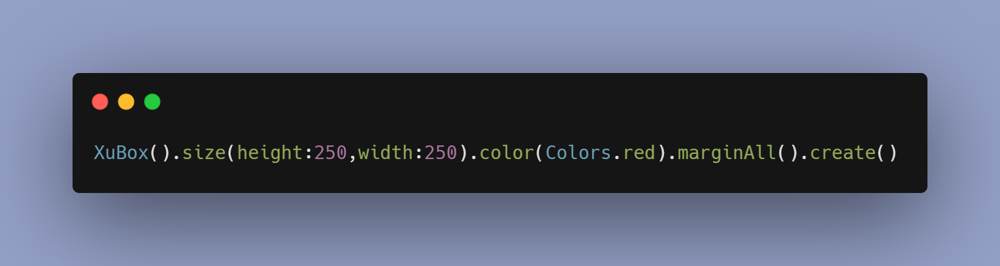
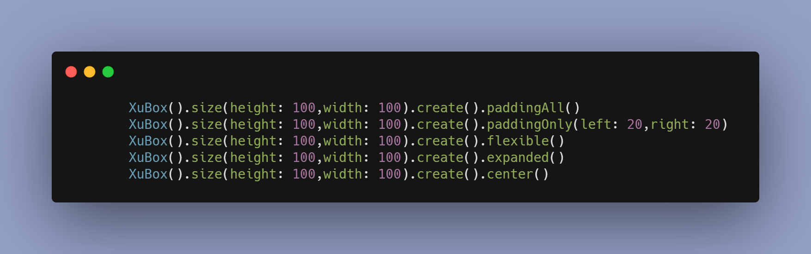

# XuXu UI - Useful Mini Framework


# Installing

Add it to your `pubspec.yaml` file:
```yaml
dependencies:
  xuxu_ui: ^0.0.2
```
Install packages from the command line
```
flutter packages get
```
If you like this package, consider supporting it by giving it a star on [GitHub](https://github.com/i-Senku/XuXu-UI) and a like on [pub.dev](https://pub.dev/packages/xuxu_ui) ❤️

# Basic Example



# Important Keywords And Usage Rules
* All Widgets start with **Xu**
* To declare that the widget created with XuXu UI is a widget, the **create()** function should work.
* The **create()** function should always be called after all operations have finished.


# XuBox - Container

* After all the operations, we specify that this is a widget with **.create()**.
* With **XuBoxDecration**, you can use your DecorationBox features more easily and quickly.


# XuText - Text
* After all the operations, we specify that this is a widget with **.create()**.


# XuVStack - Column

* Important Functions

 Function | Description 
--- | ---
space() | Adds space between `all` widgets in `vertical` alignment
bgColor() | Assigns background color to `all` widgets
unique() | It excludes widgets that you do not want to be affected by the `space` and background functions.


# XuHStack - Row

* Important Functions

 Function | Description 
--- | ---
space() | Adds space between `all` widgets in `horizontal` alignment
bgColor() | Assigns background color to `all` widgets
unique() | It excludes widgets that you do not want to be affected by the `space` and background functions.


# XuListBuilder - ListView.builder

 Function | Description 
--- | ---
count() | Adds space between `all` widgets in `horizontal` alignment
pAll() | Padding All
pOnly() | Padding Only ( left - right - bottom - top)
wrap() | shinkWrap

* and more ..


# SpaceH & SpaceV - SizedBox

Widgets | Description 
--- | ---
SpaceH | `Horizontal` space
SpaceV | `Vertical` space


# Gestures - GestureDetector ( Auto Updated State )
* Available gesturs

* onTap
* onDoubleTap
* onLongPress

Parameter | Description 
--- | ---
state | The `state` parameter is optional. If you do not want to call the `SetState` function and you want the variable on the screen to be updated, you should assign `this` to `state` parameter. Remember, this is an optional parameter, it will not update the state unless you assigns it.


# Useful Extensions -- Expanded - Flexible - Center - Padding

Extensions | Description 
--- | ---
expanded() | `Expanded` Widget
flexible() |`Flexible` Widget
center() | `Center` Widget
paddingAll() | `EdgeInsets.all` Widget
paddingOnly() | `EdgeInsets.only` Widget
unique() | It's important for `XuHStack` and `HuVStack`



# Contact

* [Linkedin](https://pub.dev/packages/xuxu_ui)
* **ercangp34@gmail.com**